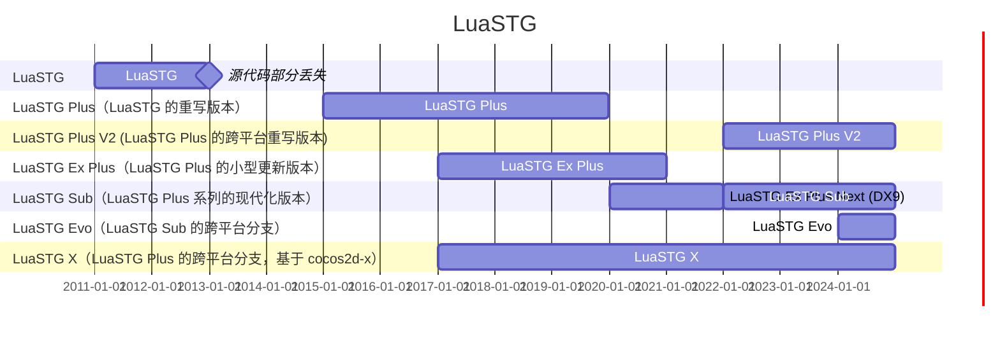

# Welcome to LuaSTG Community!

## Different versions/forks of LuaSTG engine

## Portal

* [LuaSTG (archived)](https://github.com/Legacy-LuaSTG-Engine/LuaSTG-Root)
* [LuaSTG Plus](https://github.com/9chu/LuaSTGPlus/tree/legacy)
* [LuaSTG Plus V2](https://github.com/9chu/LuaSTGPlus)
* [LuaSTG Ex Plus (archived, backup, original repository deleted)](https://github.com/Legacy-LuaSTG-Engine/Legacy-LuaSTG-Ex-Plus)
* [LuaSTG Sub](https://github.com/Legacy-LuaSTG-Engine/LuaSTG-Sub)
* [LuaSTG Evo](https://github.com/KaleiAlma/LuaSTG-Evo)
* [LuaSTG X](https://github.com/Xrysnow/LuaSTG-x)

---

# 欢迎来到 LuaSTG 社区！

## LuaSTG 引擎的不同版本/分支

## 传送门

* [LuaSTG（已归档）](https://github.com/Legacy-LuaSTG-Engine/LuaSTG-Root)
* [LuaSTG Plus](https://github.com/9chu/LuaSTGPlus/tree/legacy)
* [LuaSTG Plus V2](https://github.com/9chu/LuaSTGPlus)
* [LuaSTG Ex Plus（已归档，备份，原仓库已被删除）](https://github.com/Legacy-LuaSTG-Engine/Legacy-LuaSTG-Ex-Plus)
* [LuaSTG Sub](https://github.com/Legacy-LuaSTG-Engine/LuaSTG-Sub)
* [LuaSTG Evo](https://github.com/KaleiAlma/LuaSTG-Evo)
* [LuaSTG X](https://github.com/Xrysnow/LuaSTG-x)
